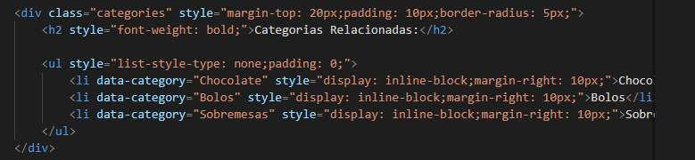
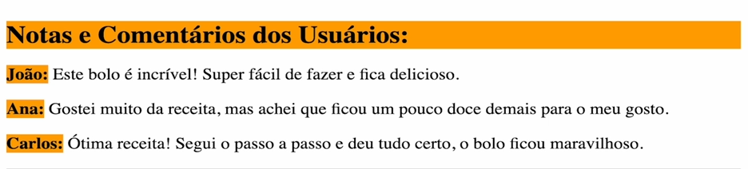
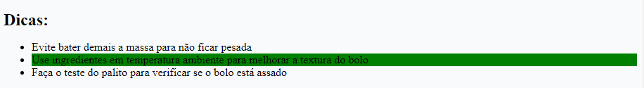
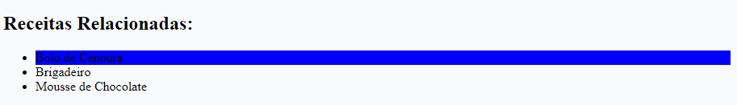
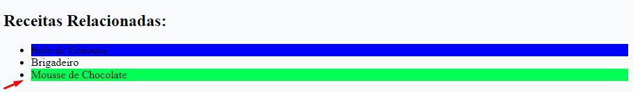

/* Funções css */
1. Função de negação, quando eu não quero selecionar algo dentro da minha seleção

.categories > h2 {
    background-color: red;
}
aqui eu selecionei uma todo o filho direto de h2

2. aqui eu to selecionando tudo menos o h2
.categories > :not(h2) {
    background-color: red;
}

o :not() - Remove o elemento do seletor
Imagem de referencia abaixo

3. Aqui vou selecionar todos os elementos descendentes de #comments-list que não sejam uma div nem um p
#comments-list :not(div):not(p) {
    background-color: green;
}

ou 

#comments-list :not(div, p) {
    background-color: green;
}

4. podemos selecionar um item de uma lista ou de uma hierarquia  de tags baseado em número
.tips li:nth-child(2) {
    background-color: green;
}

5. Agora vamos usar uma função que seleciona o primeiro filho
.related-recipes li:first-child {
    background-color: blue;
}

6. Agora vamos usar uma função que seleciona o ultimo filho
.related-recipes li:last-child {
    background-color: rgb(0, 255, 85);
}

