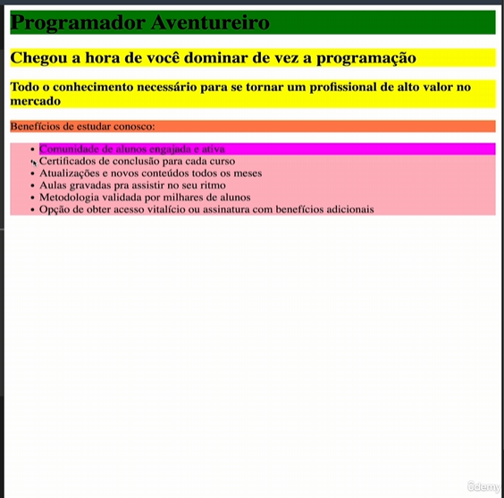

1. Selecionar id
    {
        #valor do id {
            background-color: red;
        }
    }

2. Selecionar classe
    {
        .nome da classe {
            background-color: red;
        }
    }

3. Selecionar listas
    {
        ul.lista-id ou classe {
            background-color: red;
        }
    }
4.    #id.classe {          //combinando id com classe
        background-color: red;
    }

5. Multiplas classes
    {
        .classe1.classe2 {
            background-color: red;
        }
    }

6. Outro id com classe
    {
        li#nomeid.nomeclasse {
            background-color: red;
        }
    }

IMG 
