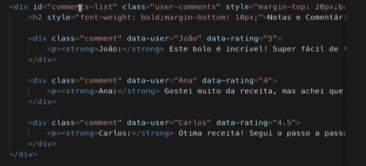

1. varios filhos diretos que são irmãos entre si

uma div que possui uma classe x que eu quero selecionar todas as irmãs de uma div que possui uma classe x
mas ela pega só A PARTIR DA DIV, NAO O QUE VEM ANTES, então use com cuidado.

div.nomeclasse ~ div {
    background-color: red;
}

div.nomeclasse > div > h2 ~ div strong
{
    background-color: red;
}