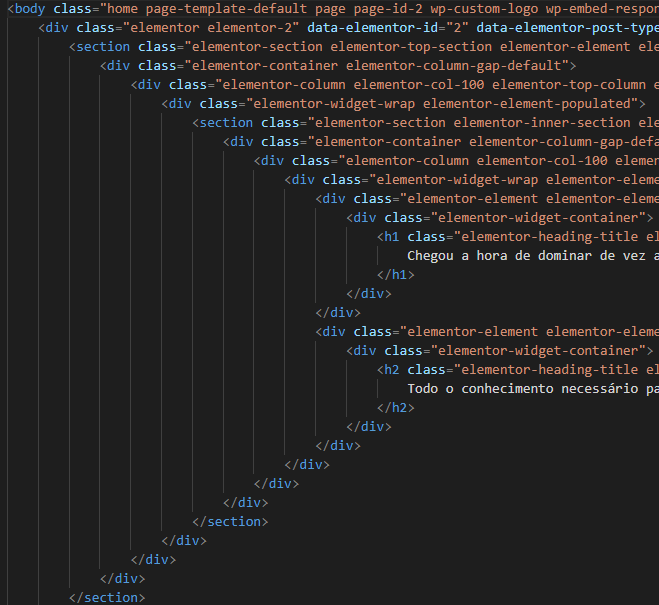
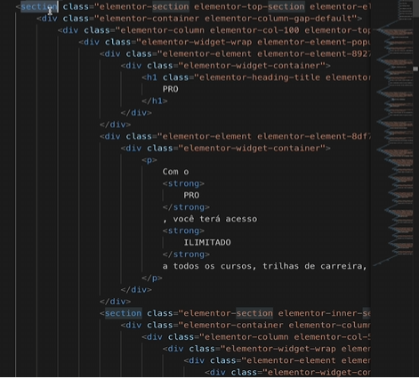

1. Quando temos uma section detro de outra section

section section {
    background-color: red;
}

esse css modifica todas as sections que são filhas das section
no meu codigo todo e os modifica (se atente ao nome correto na vida real)
SELETOR DESCENDENTE O NOME

Posso ir concatenando de forma direcional as tags pais e filhas 

section p strong {
    background-color: red;
}

2. Selecionando divs
para dizer que estamos pegando um descendente usamos o espaço

#idnome li {
    background-color: red;
}

div.classenome {
    background-color: red;
}

.classenome1 (filho) .classnome2 p{
    background-color: red;
}

3. filhos diretos e filhos imediatos
p > strong { //aqui ele seleciona todas as tags pq que tem como filho direto uma tag strong nessa regra
    background-color: red;
}

 // descendente então ele não precisa ser direto a unica tag disponivel na hierarquia mas sim algo dentro da tag.. netto e etc
p strong {
    bakcground-color: red;
}

4. Multiplos filhos diretos

li > .classe > span {
    background-color: red;
}

5. DESCENDENTE USA ESPAÇO, FILHO DIRETO USAMOS ( > )